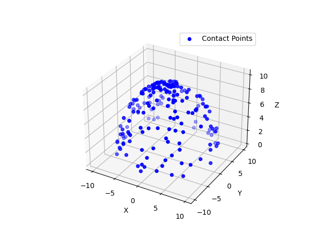
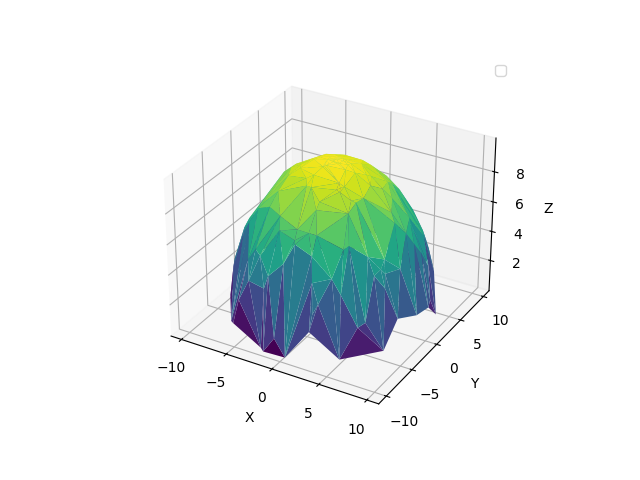
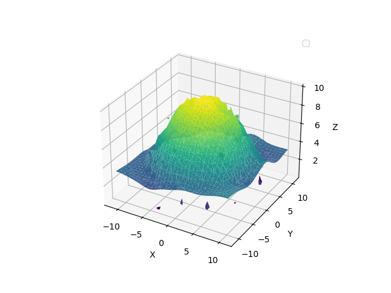

# Result
## Simulated 3D Point Cloud  of Contact Points of Catheter End

## 3D Surface Reconstruction using Delaunay Triangulation

## 3D Surface Reconstruction using Poisson Surface Reconstruction

